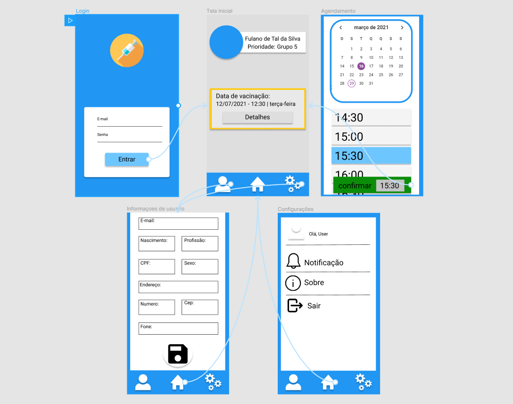

# Projeto da Solução

Pré-requisitos: <a href="4-Gestão-Configuração.md"> Ambiente e Ferramentas de Trabalho</a>

## Tecnologias Utilizadas
Para nossa solução foi utilizadas varias tecnologias para obtermos o resultado final esperado, como banco de dados armazenados na nuvem, telas intuitivas, sistema de login , entre outros.

Para desenvolver o aplicativo e todo sem esquema de telas, utilizamos Flutter, que é um kit de desenvolvimento de interface de usuário baseado na linguagem Dart.

Para armazenamento de dados de usuarios, utilizamos o serviço da Google, FireBase. No firebase, armazenamos não só os dados de usuarios, mas tambem todos os outros, como, datas disponíveis para agendamento e dados de vacinas.

Utilizamos tambem o serviço da Azure, Azure Functions (API), que está sendo utilizado como backend da aplicação. Utilizamos ele para executar tarefas fora da aplicação.

## Arquitetura da solução

