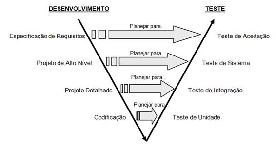

# Avaliação da Aplicação

Pré-requisitos: <a href="6-Implementação.md"> Projeto da Solução</a>

Os testes serão realizados nas seguintes telas e funcionalidades:

- Login;
- Tela de agendamento;
- Confirmar agendamento;
- Tela de configuração;
- Tela de Editar usuário;
- Seleção de Data/Hora;
- Frame de Confirmado;

## Plano de Testes
### Tipos de testes aplicado
- Teste de regressão: Esse consiste em realizar testes a cada versão de um software, onde se modificam-se funcionalidades. Desse modo, evita-se que erros que foram corrigidos antes no software antes voltem a aparecer na hora de se incrementar algo novo a ele.

- Teste de unidade: Testa-se unidades menores de um software, de modo isolado, para ver se todas funcionam adequadamente;

- Teste de integração: Depois das unidades testadas, realiza-se uma verificação se elas funcionam juntas, integradas. Pode ocorrer delas apresentarem incompatibilidades ao funcionarem em conjunto, mesmo após terem sido aprovadas no teste de unidade;

- Teste de usabilidade: Esse teste é feito por um pequeno grupo de usuários para ver se o software satisfaz as suas necessidades.  Nesse teste analisa-se como o usuário usa o sistema, verificando onde ele tem mais dificuldade. Ouve-se também suas impressões, porém é preciso confrontá-las com as observações do avaliador;

### Funcionalidades testadas:
| Tela/Funcionalidade | Testes |
|-------------------------|-----------------------------|
| Login | Teste de unidade, Teste de integração |
| Tela de agendamento | Teste de unidade, Teste de usabilidade |
| Confirmar agendamento | Teste de unidade, Teste de integração |
| Tela de configuração | Teste de unidade, Teste de usabilidade |
| Tela de Editar usuário | Teste de unidade, Teste de integração |
| Seleção de Data/Hora | Teste de unidade, Teste de integração |
| Frame de Confirmação | Teste de unidade, Teste de integração |

E a cada funcionalidade implementada foi feito o Teste de Regressão

### Fluxo dos testes

## Ferramentas de Testes

Comente sobre as ferramentas de testes utilizadas.
- [Ferramentas de Test para Flutter](https://flutter.dev/docs/testing)

## Avaliação

> Discorra sobre os resultados do teste. Ressaltando pontos fortes e
> fracos identificados na solução. Comente como o grupo pretende atacar
> esses pontos nas próximas iterações. Apresente as falhas detectadas e
> as melhorias geradas a partir dos resultados obtidos nos testes.
